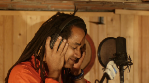
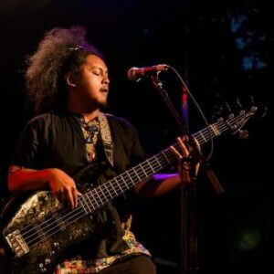
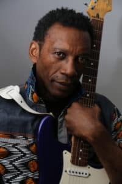
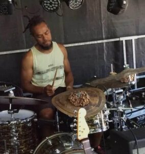

# Le FK-Group

> Franck Kouby revient avec le FK-Group, une nouvelle formation captivante.
>
> À travers des textes chantés en créole et en français, le groupe transporte le public à travers l’Europe, les Antilles, l’Afrique, et l’Amérique.
>
> La musique du FK-Group est une fusion vibrante de rythmes créoles traditionnels, de jazz, de reggae, de zouk, et même d’une touche de rock, créant ainsi un style unique appelé « Fusion créole ».
>
> Fort de plus de 30 ans d’expérience scénique, Franck Kouby s’entoure de musiciens talentueux aux influences diverses pour recréer la magie et la diversité musicale qui caractérisent le FK-Group.
>
> Cette fusion créole incarne la créativité et l’énergie d’un musicien chevronné et de ses collaborateurs talentueux, offrant ainsi une expérience musicale unique et inoubliable.

## Les musiciens

| Photo                                                                                 | Présentation                                                                                                                                                                                                                                                                                                                                                                                                                                                                                                                                                                                                                                                                                                                                                                                                  |
| ------------------------------------------------------------------------------------- | ------------------------------------------------------------------------------------------------------------------------------------------------------------------------------------------------------------------------------------------------------------------------------------------------------------------------------------------------------------------------------------------------------------------------------------------------------------------------------------------------------------------------------------------------------------------------------------------------------------------------------------------------------------------------------------------------------------------------------------------------------------------------------------------------------------- |
|                           | **[Franck Kouby](mailto:franckkouby@gmail.com)** <em>Auteur, compositeur, interprète, guitariste et chanteur</em>  Franck Kouby, artiste polyvalent, auteur, compositeur et interprète, émerge comme une figure emblématique de la scène musicale avec plus de 30 ans de carrière. Né de la fusion du jazz et des percussions latino-africaines à l’École Nationale de Musique (ENM), Franck a dirigé le groupe Natty et collaboré avec des compagnies de danse contemporaine.  <strong>Contact</strong> Téléphone : +33 (6) 60 38 88 28 E-mail : [franckkouby@gmail.com](mailto:franckkouby@gmail.com) [Facebook](https://www.facebook.com/FranckKouby) · [YouTube](http://www.youtube.com/user/FranckKouby) · [SoundCloud](https://soundcloud.com/franck-kouby/) |
|                                | **Heri Andrianasolo** <em>Clavier</em>  Né en 1983 à Antananarivo, Heri est un pianiste, claviériste et compositeur malgache renommé, considéré comme un virtuose du clavier. Pionnier de l’électro-jazz à Madagascar, il remporte le concours de piano du Festival Jazz à Juan en 2003. Son album solo « Mahana » mêle traditions malgaches, jazz, funk et électronique.                                                                                                                                                                                                                                                                                                                                                                                                                      |
|                | **Toavina Mirado** <em>Basse</em>  Natif de Madagascar, Toavina a intégré différentes formations de jazz, rock, funk, hip-hop et musique du monde depuis son arrivée en France en 2013. Ses expériences musicales lui ont permis de développer une grande polyvalence.                                                                                                                                                                                                                                                                                                                                                                                                                                                                                                                         |
|                                                  | **Mag Mouele** <em>Guitare</em>  Originaire de Pointe-Noire au Congo-Brazzaville, Mag Mouele est un musicien autodidacte. Il a marqué une génération de musiciens congolais avec son concept de guitare « ethno-fusion », mêlant harmonies jazz-rock et rythmes traditionnels. Il a notamment partagé la scène avec Tiken Jah Fakoly.                                                                                                                                                                                                                                                                                                                                                                                                                                                          |
|  | **Laurent Nedja** <em>Batterie</em>  Originaire de Nouvelle-Calédonie, Laurent découvre la batterie dès son enfance. Arrivé en France, il poursuit sa formation musicale dans des ensembles variés et explore le jazz, le funk, le blues et le gospel.                                                                                                                                                                                                                                                                                                                                                                                                                                                                                                                                         |

### En studio

- Franck Kouby (Guitare, voix et arrangements).
- Cindy Marthely (Choriste).
- Jean-Philippe Marthely (Choriste)
- Thierry Vatton (Arrangement additionnel, clavier, basse et programmation).
- Ronald Tulle (Piano).
- Manu Amadei Guiseppi (Saxophone et clarinette).
- Michel Alibo (Basse).
- Thomas Bélon (Batterie).

# TÉMOIGNAGES

  <article class="testimonial-card">
    <blockquote>Toujours le son après toutes ces années. Hey Bill, ça fait plaisir de te voir sur YouTube !</blockquote>
    <footer><strong>Pierre Baudinat</strong><time datetime="2019-08-31">31 août 2019</time></footer>
  </article>
  <article class="testimonial-card">
    <blockquote>Salut Franck, Sympa tes derniers airs, exotiques toujours… Bon vent ! Flo.</blockquote>
    <footer><strong>Florence F</strong><time datetime="2014-04-26">26 avril 2014</time></footer>
  </article>
  <article class="testimonial-card">
    <blockquote>Bravo Franck, que d’émotions dans tes mots, notes musicales… C’est juste profond, juste toi… On en veut encore, fonces ! Flo.</blockquote>
    <footer><strong>Florence FB</strong><time datetime="2013-02-04">4 février 2013</time></footer>
  </article>
  <article class="testimonial-card">
    <blockquote>Merci Franck,  C’est super et quelle voix ! Continue.</blockquote>
    <footer><strong>Christian C</strong><time datetime="2011-10-13">13 octobre 2011</time></footer>
  </article>
  <article class="testimonial-card">
    <blockquote>Mon ami,  J’aimerais avoir de tes nouvelles. Beaucoup de plaisir à lire quelques lignes au sujet de ta musique après plus de 20 ans. Le feeling est toujours au rendez-vous, je constate. Un bon groove et de la profondeur encore et encore. Bravo ! Plis fos’</blockquote>
    <footer><strong>Montanus Thierry</strong><time datetime="2011-09-17">17 septembre 2011</time></footer>
  </article>
  <article class="testimonial-card">
    <blockquote>Slt Frank Kouby, je suis tombée sur ton site, c’est super. Bonne chance, à bientôt.</blockquote>
    <footer><strong>Kouby Brigitte</strong><time datetime="2011-09-11">11 septembre 2011</time></footer>
  </article>
  <article class="testimonial-card">
    <blockquote>Yeahhhh, je ne savais pas que tu avais sorti un album, ça déchiiiire… Je suis tombée sur ton site par hasard, et c’est super !  À très bientôt Franck, pour de nouvelles aventures musicales. =)</blockquote>
    <footer><strong>Clémentine Rodriguez</strong><time datetime="2011-03-16">16 mars 2011</time></footer>
  </article>
  <article class="testimonial-card">
    <blockquote>Des magnifiques morceaux comme ceux-là, on en veut encore et encore ! Superbement accompagnés par de bons musiciens, dont Antoine Laville, et son phrasé exceptionnel !  Bravo Franck !</blockquote>
    <footer><strong>Jean-Claude Braillon</strong><time datetime="2011-02-24">24 février 2011</time></footer>
  </article>
  <article class="testimonial-card">
    <blockquote>Salut missié Kouby, je vois que ça ne va pas trop mal pour toi ! J’espère que l’on se croisera un de ces quatre ! À bientôt ! Tchimbe rèd !</blockquote>
    <footer><strong>Luc Blackstone</strong><time datetime="2011-01-17">17 janvier 2011</time></footer>
  </article>

